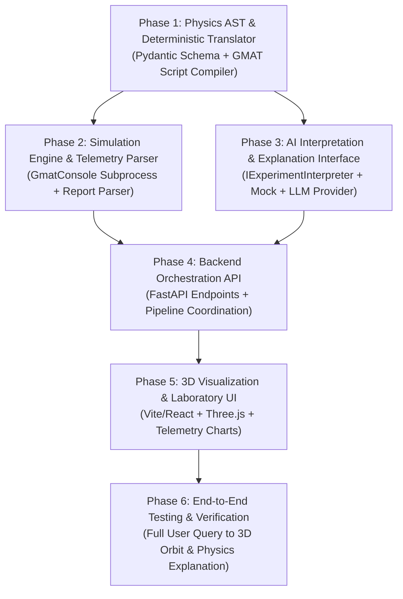

# OrbitLab: System Architecture & Specification

## A. Current Repository Assessment

| Aspect | Current Status | Notes |
| :--- | :--- | :--- |
| **Workspace Location** | `C:\Users\canit\DevSwarmProjects\Orbitlab` | Clean repository root |
| **Git Status** | Branch `main`, Commit `8cbe096` | Initial commit (empty tree) |
| **Repository Contents** | `.gitignore`, `.devswarm-temp/` | Clean workspace |
| **Frontend** | Not yet initialized | Greenfield |
| **Backend** | Not yet initialized | Greenfield |
| **Build System / Dependencies** | None currently committed | Python 3.13 / 3.11, Node.js v22.20.0, npm 11.8.0, Git 2.52.0 available on host |
| **Physics Simulation Engine** | NASA GMAT R2026a (Windows 64-bit) | Located at `C:\Users\canit\XY\Downloads\gmat-win-R2026a` |

---

## B. Proposed OrbitLab Architecture

OrbitLab enforces a strict decoupling between non-deterministic AI language understanding and deterministic physics execution.

### Architectural Diagram

```
+---------------------------------------------------------------------------------------+
|                                    User Interface                                     |
|    (React / Vite / TailwindCSS / Three.js 3D Viewport / Orbit Scrubbing & Telemetry)  |
+------------------------------------------+--------------------------------------------+
                                           | HTTP / WebSocket
                                           v
+---------------------------------------------------------------------------------------+
|                               FastAPI Backend Server                                  |
|                                                                                       |
|   1. NL Request ──────> [ AI Experiment Interpreter Interface ]                       |
|                                     │ (Domain Model / Structured Output)              |
|                                     v                                                 |
|   2. Validation <────── [ OrbitLab Experiment JSON ]                                  |
|         │                        (Pydantic AST)                                       |
|         v                                                                             |
|   3. Translation ─────> [ Deterministic GMAT Script Generator ]                       |
|                                     │ (Parameterized .script generator)               |
|                                     v                                                 |
|   4. Execution ───────> [ Sandboxed GMAT Runner Engine ]                              |
|                                     │ (GmatConsole.exe subprocess + timeout)          |
|                                     v                                                 |
|   5. Ingestion <─────── [ Simulation Output Parser ]                                  |
|         │                        (ReportFile / Ephemeris parser)                      |
|         v                                                                             |
|   6. Explanation ─────> [ AI Physics Explanation Engine ]                             |
|                                     │ (Orbital Mechanics Analysis)                    |
|                                     v                                                 |
|   7. Response ────────> { Trajectory JSON + Telemetry + AI Explanation }              |
+---------------------------------------------------------------------------------------+
```

### Component Boundaries

1. **AI Experiment Interpreter (`IExperimentInterpreter`)**:
   - Converts natural-language user experiments into structured `OrbitLabExperiment` JSON.
   - Decoupled interface to support general-purpose LLMs in development and specialized/domain-adapted models in production.
2. **Schema & Astrodynamic Sanity Validator**:
   - Enforces Pydantic v2 schemas and astrodynamic boundaries (e.g. periapsis radius $> R_{earth} + 100\text{ km}$, $0 \le e < 1$ for bound orbits, valid coordinate frames).
   - Rejects unphysical or unsafe configurations prior to compilation.
3. **Deterministic GMAT Script Generator**:
   - Translates the structured AST into valid, sanitized GMAT scripts.
   - **Crucial Rule**: The AI never generates raw GMAT script code directly. The generator utilizes deterministic templates and parameterized procedural builders.
4. **Sandboxed GMAT Runner Engine (`GmatExecutionEngine`)**:
   - Invokes `GmatConsole.exe` in headless mode within temporary, run-isolated workspaces.
   - Implements execution timeouts and process isolation.
5. **Simulation Output Parser**:
   - Reads GMAT `ReportFile` tab/space-delimited telemetry into memory.
   - Extracts cartesian vectors $(X, Y, Z, V_x, V_y, V_z)$, Keplerian elements $(a, e, i, \Omega, \omega, \theta)$, and maneuver milestones.
   - Provides adaptive downsampling for 60fps WebGL rendering.
6. **AI Physics Explanation Engine (`IPhysicsExplainer`)**:
   - Compares initial experiment parameters against empirical simulation outcomes.
   - Generates educational and analytical orbital mechanics explanations.
7. **Laboratory Web UI**:
   - Interactive 3D orbital viewer (Three.js), natural language prompt console, parameter inspector, and telemetry timelines.

---

## C. Preliminary Experiment JSON Schema

```json
{
  "$schema": "http://json-schema.org/draft-07/schema#",
  "title": "OrbitLabExperiment",
  "type": "object",
  "required": ["version", "experimentName", "spacecraft", "initialOrbit", "propagation"],
  "properties": {
    "version": { "type": "string", "enum": ["1.0"] },
    "experimentName": { "type": "string", "maxLength": 100 },
    "description": { "type": "string" },
    "spacecraft": {
      "type": "object",
      "required": ["name", "dryMassKg"],
      "properties": {
        "name": { "type": "string", "pattern": "^[A-Za-z0-9_]{1,30}$" },
        "dryMassKg": { "type": "number", "minimum": 0.1, "maximum": 500000 },
        "coefficientOfDrag": { "type": "number", "default": 2.2, "minimum": 0, "maximum": 5.0 },
        "dragAreaM2": { "type": "number", "default": 1.0, "minimum": 0.01, "maximum": 1000 },
        "coefficientOfReflectivity": { "type": "number", "default": 1.8, "minimum": 0, "maximum": 2.0 },
        "srpAreaM2": { "type": "number", "default": 1.0, "minimum": 0.01, "maximum": 1000 }
      }
    },
    "centralBody": {
      "type": "string",
      "enum": ["Earth", "Moon", "Mars"],
      "default": "Earth"
    },
    "epoch": {
      "type": "object",
      "required": ["format", "value"],
      "properties": {
        "format": { "type": "string", "enum": ["UTCGregorian"], "default": "UTCGregorian" },
        "value": { "type": "string", "default": "01 Jan 2026 12:00:00.000" }
      }
    },
    "initialOrbit": {
      "type": "object",
      "required": ["type", "coordinateSystem", "elements"],
      "properties": {
        "type": { "type": "string", "enum": ["Keplerian", "Cartesian"] },
        "coordinateSystem": { "type": "string", "enum": ["EarthMJ2000Eq"], "default": "EarthMJ2000Eq" },
        "elements": {
          "type": "object",
          "properties": {
            "semiMajorAxisKm": { "type": "number", "minimum": 6478.137 },
            "eccentricity": { "type": "number", "minimum": 0.0, "maximum": 0.99 },
            "inclinationDeg": { "type": "number", "minimum": 0.0, "maximum": 180.0 },
            "raanDeg": { "type": "number", "minimum": 0.0, "maximum": 360.0 },
            "argumentOfPeriapsisDeg": { "type": "number", "minimum": 0.0, "maximum": 360.0 },
            "trueAnomalyDeg": { "type": "number", "minimum": 0.0, "maximum": 360.0 },
            "xKm": { "type": "number" },
            "yKm": { "type": "number" },
            "zKm": { "type": "number" },
            "vxKmS": { "type": "number" },
            "vyKmS": { "type": "number" },
            "vzKmS": { "type": "number" }
          }
        }
      }
    },
    "forceModel": {
      "type": "object",
      "default": {},
      "properties": {
        "gravityDegree": { "type": "integer", "minimum": 0, "maximum": 20, "default": 4 },
        "gravityOrder": { "type": "integer", "minimum": 0, "maximum": 20, "default": 4 },
        "pointMasses": {
          "type": "array",
          "items": { "type": "string", "enum": ["Luna", "Sun", "Jupiter"] },
          "default": ["Luna", "Sun"]
        },
        "atmosphericDrag": {
          "type": "object",
          "properties": {
            "enabled": { "type": "boolean", "default": false },
            "model": { "type": "string", "enum": ["JacchiaRoberts", "MSISE90"], "default": "JacchiaRoberts" }
          }
        },
        "solarRadiationPressure": { "type": "boolean", "default": true }
      }
    },
    "maneuvers": {
      "type": "array",
      "items": {
        "type": "object",
        "required": ["id", "type", "trigger"],
        "properties": {
          "id": { "type": "string", "pattern": "^[A-Za-z0-9_]{1,20}$" },
          "type": { "type": "string", "enum": ["ImpulsiveBurn", "TargetedHohmannTransfer"] },
          "trigger": {
            "type": "object",
            "required": ["condition"],
            "properties": {
              "condition": { "type": "string", "enum": ["AtPeriapsis", "AtApoapsis", "ElapsedTimeSecs"] },
              "elapsedSecs": { "type": "number", "minimum": 0 }
            }
          },
          "burnVector": {
            "type": "object",
            "properties": {
              "coordinateSystem": { "type": "string", "enum": ["LocalVNB"], "default": "LocalVNB" },
              "deltaVVectorKmS": {
                "type": "array",
                "items": { "type": "number" },
                "minItems": 3,
                "maxItems": 3,
                "description": "[V_velocity, N_normal, B_binormal] in km/s"
              }
            }
          },
          "targetObjectives": {
            "type": "object",
            "properties": {
              "targetOrbitRadiusKm": { "type": "number", "minimum": 6500 },
              "targetEccentricity": { "type": "number", "minimum": 0.0, "maximum": 0.99 }
            }
          }
        }
      },
      "default": []
    },
    "propagation": {
      "type": "object",
      "required": ["stopCondition"],
      "properties": {
        "integrator": { "type": "string", "enum": ["RungeKutta89", "PrinceDormand78"], "default": "RungeKutta89" },
        "stopCondition": {
          "type": "object",
          "required": ["type", "value"],
          "properties": {
            "type": { "type": "string", "enum": ["ElapsedDays", "ElapsedHours", "ElapsedSeconds", "OrbitPeriods"] },
            "value": { "type": "number", "minimum": 0.001, "maximum": 365.0 }
          }
        },
        "stepSizeSecs": { "type": "number", "minimum": 0.1, "maximum": 3600.0, "default": 60.0 }
      }
    }
  }
}
```

---

## D. GMAT Integration Approach

### 1. Programmatic Invocation
- Backend will execute `GmatConsole.exe` via asynchronous subprocesses:
  ```powershell
  & "C:\Users\canit\XY\Downloads\gmat-win-R2026a\bin\GmatConsole.exe" --run <script_path> --exit
  ```
- Subprocess execution ensures strict process isolation, timeout enforcement, and memory safety without crashing the API backend.
- Benchmark during reconnaissance confirmed execution in **0.047 seconds** for typical propagation sequences.

### 2. Output Retrieval
- Scripts will deterministically define a `ReportFile` subscriber emitting space/tab-delimited tables:
  ```matlab
  Create ReportFile OrbitLabReport;
  OrbitLabReport.Filename = '<run_dir>/telemetry.txt';
  OrbitLabReport.Precision = 8;
  OrbitLabReport.WriteHeaders = true;
  OrbitLabReport.Add = {Sat.ElapsedSecs, Sat.EarthMJ2000Eq.X, Sat.EarthMJ2000Eq.Y, Sat.EarthMJ2000Eq.Z, ...
                        Sat.EarthMJ2000Eq.VX, Sat.EarthMJ2000Eq.VY, Sat.EarthMJ2000Eq.VZ, ...
                        Sat.Earth.SMA, Sat.Earth.ECC, Sat.Earth.INC, Sat.Earth.Altitude};
  ```
- Output is ingested into typed numerical data structures, validated, and normalized for API delivery.

---

## E. Recommended DevSwarm Workspaces & Workstreams

| Workspace | Domain | Key Responsibilities | Dependencies |
| :--- | :--- | :--- | :--- |
| **`orbitlab-physics-core`** | AST & Script Compiler | Pydantic Experiment schemas, physical validator, deterministic GMAT script generator, compiler unit tests | None |
| **`orbitlab-simulation-engine`** | GMAT Execution & Parsing | Subprocess runner (`GmatConsole.exe`), sandbox management, timeout watchdog, `ReportFile` telemetry parser | `orbitlab-physics-core` |
| **`orbitlab-ai-interpreter`** | Language & Explanation | `IExperimentInterpreter` interface, structured output LLM adapter, mock interpreter, physics explainer prompts | `orbitlab-physics-core` |
| **`orbitlab-api-service`** | Backend Orchestrator | FastAPI service, REST & WebSocket routes, pipeline coordination, caching | Core, Engine, & AI |
| **`orbitlab-web-ui`** | 3D Visualization & UX | React / Vite / Three.js 3D Earth & orbit viewport, prompt console, telemetry graphs, parameter inspector | API Service (or mock) |

---

## F. Risks and Technical Constraints

1. **Targeter Divergence**: GMAT differential correctors can fail to converge if initial perturbation bounds are unconstrained. Mitigated by bounded solve parameters and defensive error propagation.
2. **Path Separator Formatting**: Windows backslashes in GMAT scripts cause escape errors. Mitigated by strict forward-slash (`/`) path normalization across all generated scripts.
3. **AI Hallucinations**: Addressed by strict Pydantic astrodynamic boundary checks ($r_p \ge R_E + 100\text{ km}$, $0 \le e < 1$) before script generation.
4. **Telemetry Volume**: Multi-orbit runs create large data files. Mitigated by server-side decimation keeping WebGL coordinate payloads $\le 2000$ points.

---

## G. Implementation Plan (Ordered by Dependency)


